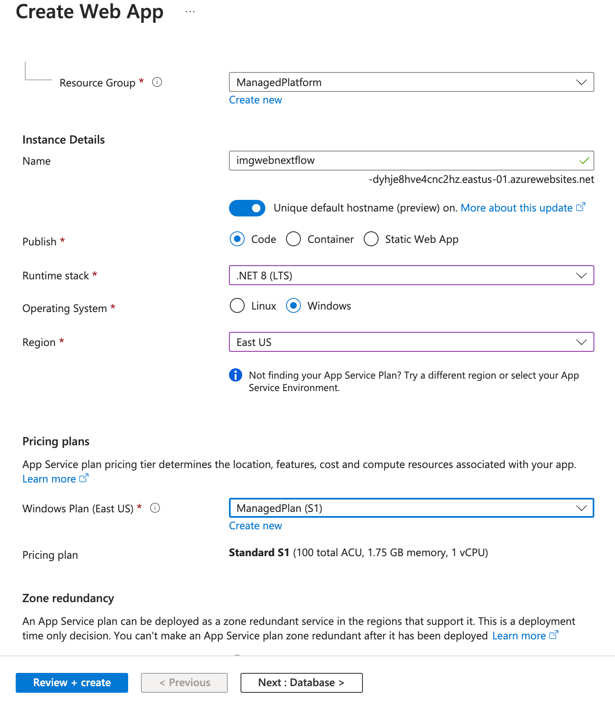

# Lab 02: Build a web application on Azure platform 

## Microsoft Azure user interface

Given the dynamic nature of Microsoft cloud tools, you might experience Azure UI changes that occur after the development of this training content. As a result, the lab instructions and lab steps might not align correctly.

Microsoft updates this training course when the community alerts us to needed changes. However, cloud updates occur frequently, so you might encounter UI changes before this training content updates. **If this occurs, adapt to the changes, and then work through them in the labs as needed.**

## Instructions

### Before you start

#### Sign in to the lab environment

Sign in to your Azure portal using the credentials provided.

> **Note**: Your lab host will provide instructions to connect to the virtual lab environment.

#### Task 1: Open the Azure portal

1. On the taskbar, select the **Microsoft Edge** icon.

2. In the browser window, browse to the Azure portal at `https://portal.azure.com`, and then sign in with the account you'll be using for this lab.

   > **Note**: If this is your first time signing in to the Azure portal, you'll be offered a tour of the portal. If you prefer to skip the tour, select **Maybe later** to begin using the portal.

   
### Exercise 1: Build a front-end web application by using Azure Web Apps
   
   #### Task 1: Test the Web API

   1. In the Microsoft Edge's browser window, open the new tab, then navigate to the URL [`https://imgapi-nextflow-eyh5a5fmgmavd9as.eastus-01.azurewebsites.net/`](https://imgapi-nextflow-eyh5a5fmgmavd9as.eastus-01.azurewebsites.net/).
   2. Examine the API's response. The API should return a JSON response that contains a list of images. (Only one in this case)

   #### Task 2: Create a web app
   
   3.  On the Azure portal's **navigation** pane, select **Create a resource**.
   
   4.  On the **Create a resource** blade, in the **Search services and marketplace** text box, enter **Web App**, and then select Enter.
   
   5.  On the **Marketplace** search results blade, select **Web App**.
   
   6.  On the **Web App** blade, select **Create**.
   
   7.  On the **Create Web App** blade, on the **Basics** tab, perform the following actions, and then select the **Monitoring** tab:
   
   | Setting                            | Action                        |
   | ---------------------------------- | ----------------------------- |
   | **Subscription** drop-down list    | Retain the default value      |
   | **Resource group** section         | Select **Create new**, enter **_[yourname]_ManagedPlatform**, and then select **OK**  **(Noted this name)**  |
   | **Name** text box                  | Enter **imgweb**_[yourname]_ **(Noted this name)** |
   | **Publish** section                | Select **Code**               |
   | **Runtime stack** drop-down list   | Select **.NET 8 (LTS)**       |
   | **Operating System** section       | Select **Windows**            |
   | **Region** drop-down list          | Select the **East US** region |
   | **Windows Plan (East US)** section | Select **Create new**, enter the value **ManagedPlan** in the **Name** text box, and then select **OK** |
   | **Pricing plan** section           | Select **Standard S1**  |
   
   The following screenshot displays the configured settings on the **Create web app** blade.
   
   
   
   8.  On the **Deployment** tab, in the **Deployment source** section, select **Github**. then select **Authorize** to authorize the Azure portal to access your Github account.
      
   - Select the **Organization** that contains the repository.
   - Select the **Repository** that contains the code. In this case, it is **azure-dotnet-imgweb-repo**.
   - Select the **Branch** that contains the code. In this case, it is **main** branch.
      
      

   9.  On the **Monitoring** tab, in the **Enable Application Insights** section, select **No**, and then select **Review + create**.
      

   
   10. From the **Review + create** tab, review the options that you selected during the previous steps.
   
   11. Select **Create** to create the web app by using your specified configuration.
   
   > **Note**: Wait for the creation task to complete before you continue with this lab.
   
   12. On the **Overview** blade, select the **Go to resource** button to navigate to the blade of the newly created web app.
   
   #### Task 2: Configure a web app
   
   13. On the **App Service** blade, in the **Settings** section, select the **Environment variables** link.
   
   14. In the **Environment variables** section, perform the following actions, select **Save**, and then select **Continue**:
   
       | Setting | Action |
       |--|--|
       | **App settings** tab | Select **New application setting** |
       | **Add/Edit application setting** pop-up dialog | In the **Name** text box, enter **ApiUrl** |
       | **Value** text box | Enter the web app URL `https://imgapi-nextflow-eyh5a5fmgmavd9as.eastus-01.azurewebsites.net/` |
       | **Deployment slot setting** check box | Retain the default value, and then select **OK** |
       | Click **Save** in the  top menu | This will save the configuration value you just entered |
   
   > **Note**: Wait for the application settings to save before you continue with this lab.
   
   #### Task 3: Deploy an `ASP.NET` web application to Web Apps
   
   15. On the **App Service** blade, in the **Deployment** section, select the **Deployment Center** link. 
   
   16. Open the **Settings** tab, validate your Github deployment settings.
   
   17. Open the **Logs** tab, validate that the deployment is success
      

   18. On the **App Service** blade, select the **Overview** link, then select the **Browse** link to open the web app in a new browser tab.

   > **Note**: The web app should display the list of images from the API that you tested earlier in this lab. if not, try following instruction to solve the issue.
   > 1. Use the **Restart** button to restart the web app.
   > 2. Check the **Logs** tab to see if there is any error. then retry to deploy the web app again.

### Exercise 2: Using Deployment Slots

#### Task 1: Create a deployment slot

1. On the **App Service** blade, in the **Deployment** section, select the **Deployment slots** link.
2. Select **Add Slot**. 
3. Fill in the following information:
   - **Name**: Enter **staging**.
   - **Clone settings from**: Select **imgweb**_[yourname]_.
4. Wait for the deployment slot to be created.
5. You will see 2 deployment slots in the **Deployment slots** section. One is the **Production** slot and the other is the **Staging** slot.
   

#### Task 2: Deploy the web app to the staging slot

1. From the deployment slot list, select the **Staging** slot.
2. Please be noticed that the **Staging** slot is a separate web app. 
3. On the **App Service** blade, in the **Deployment** section, select the **Deployment Center** link.
4. Open the **Settings** tab, fill in the following information:
   - **Source**: Select **Github**.
   - In Github section, use same account, organization, repository, but select diferent branch
   - **Workflow option**: select **Add a workflow**
   - **Authentication Setting**: Select **basic authentication**.

   > Leave the other settings as default.

   

5. Select **Save** to save the configuration.
6. Open the **Logs** tab, validate that the deployment is success.
7. Open the **Overview** tab, select the **Browse** link to open the web app in a new browser tab.

> this should be another version of the web app, not the same as the production slot.

#### Task 3: Swap the deployment slots

1. Use the breadcrumb to navigate back to the **imgweb**_[yourname]_ web app.
2. On the **App Service** blade, in the **Deployment** section, select the **Deployment slots** link.
3. Select the **Swap** button.
4. In the **Swap** blade, select **Swap** to swap the **Production** and **Staging** slots.

   > **Note**: The swap operation might take a few minutes to complete.

5. After the swap operation is complete, open the **Overview** link on the **App Service** blade, and then select the **Browse** link to open the web app in a new browser tab.
6. Validate that the web app is now the same as the **Staging** slot.

### Remove the resources group

1. In the Azure portal, use the **Search resources, services, and docs** text box to search for **Resource groups**, and then in the list of results, select **_[yourname]_ManagedPlatform**.
2. On the **_[yourname]_ManagedPlatform** blade, select **Delete resource group**.
3. In the **Delete resource group** blade, enter the name of the resource group to confirm that you want to delete the resource group, and then select **Delete**.

## Review

In this exercise, you created an Azure web app and deployed an existing web application’s code to the resource in the cloud.